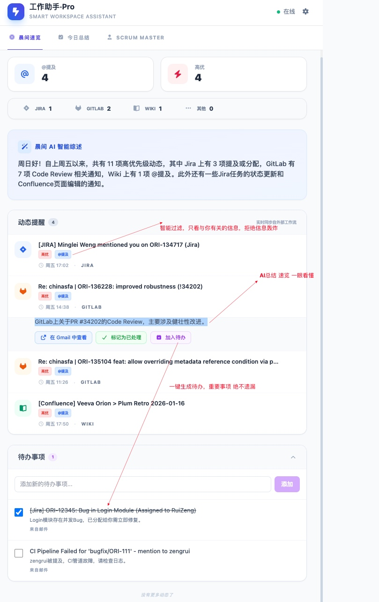
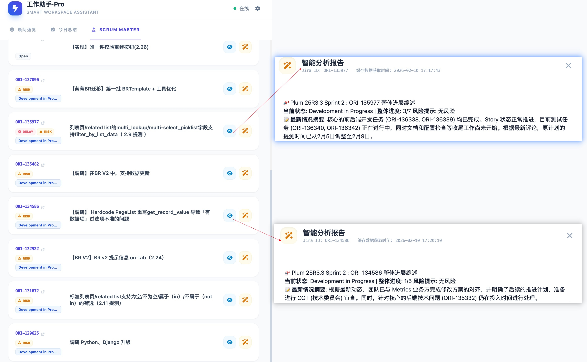
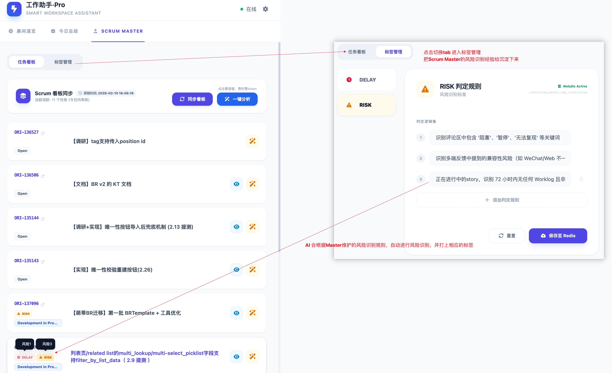
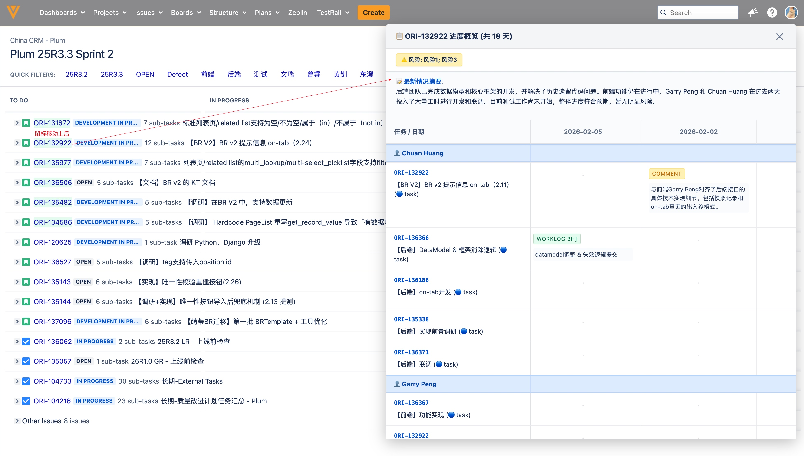
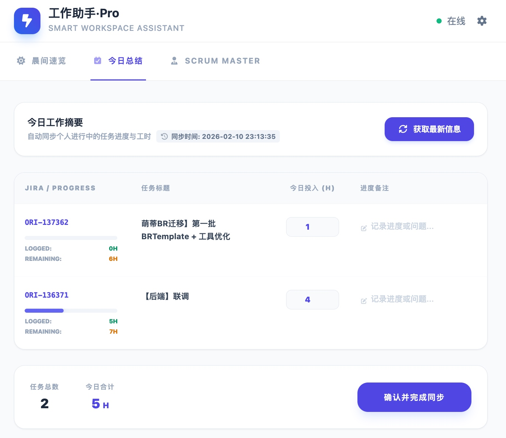

# hackthon PPT

# 概览
* 本次hackthon主题是AI相关
* 组员是黄钏和曾睿
* 队名是Streamline
* 作品介绍：旨在解决工作中各项interrupt带来的精力损耗，提醒项目组成员一键log工时，AI总结分析sprint各story每日进度，结合项目成员时间log，项目进度一目了然，降低项目组成员沟通成本，缩短早会时间

# 功能介绍
## 板块一 晨间分析
* 痛点与解决：
    * 痛点一：
        * 描述：信息爆炸 Jira Wiki Gitlab Gmail中，无时无刻都有新信息进入，需要浪费较多精力找出与自己有关的信息并通过上下文理解
        * 解决：定时抓取 多渠道信息，让AI智能过滤 “与你有关” 的信息，并简要总结，一扫即懂
        * 功能模块：功能示例中的主体部分
    * 痛点二：
        * 描述：重要信息看完就忘，导致重要事项被错过
        * 解决：一键生成待办，将“与你有关”的事项分拣到待办事项，完成后再勾选
        * 功能模块：功能示例中的下半部分
* 功能示例：

## 板块二 AI项目经理(Scrum Master)
* 痛点与解决：
    * 痛点一：
        * 描述：scrum mater每天要消耗大量的时间精力 去阅读当前sprint中每个story下的评论和问题描述，从而了解到当前story的整体进度
        * 解决：AI自动读取当前sprint的所有story下的所有子任务的最新进展和最新评论，进行概览总结，以及抓取展示近期每个story下，每个子任务的每日进度（工时和comment），整体进度一目了然
        * 功能模块：
    * 痛点二：
        * 描述：每个项目scrum master需要根据一些固定的规则，依次去判断风险进度，同时一些被识别到的风险还被忽略
        * 解决：新增标签管理模块，ScrumMaster可以在不同风险标签下 新增风险识别规则，Agent会根据这次规则，进行风险自动识别，
        * 功能模块：
    * 痛点三：
        * 描述：每个项目成员都需要花费精力组织语言，描述各自前一天进展，再由Master进行信息汇总，当项目成员描述过程不够简洁时容易导致早会超时，同时没有一个地方快速展示项目的近期进展，导致进度判断困难
        * 解决：实现浏览器插件，当鼠标移动到对应story时，自动展示当前story下所有子任务 近期每日进度，然后展示最近进展辅助判断，并结合上一步定义的风险识别规则，打上风险标签
        * 功能模块：
    * 配套工具：
        * 浏览器插件：轻量级安装
        * 串改猴：和早会流程丝滑对接

## 板块三 下班时间log
 * 痛点与解决：
    * 痛点一：
        * 描述：团队成员 总是忘记log工时，我们提供了配套的 提醒功能，下班时一个一个story打开进行工时log，很慢
        * 解决：一键获取当前进行中任务列表，支持一键工时log & comment更新；正在进行中的任务忘记log工时时，还会触发主动提醒
        * 功能模块：

* 功能示例：

# 其他
目前我们在plum的早会中已经在试运行此插件了，感觉效果还不错，其他组的scrum_master如果感兴趣，欢迎联系黄钏和曾睿，我们可以协助你们完成部署，并针对你们的需求做功能迭代优化，目前是一些正在优化中的问题：
* 部署：正在抽取所有配置到 设置模块，并制作docker以便一键部署
* 性能：目前是单线程分析，sprint的一键分析功能 耗时较长，并发分析优化 进行中
* 产品功能：
    * 易用性：目前是单机版，所有信息都在个人缓存中，后续会考虑升级scrum共享版，mater一人分析，组内所有成员仅需安装 油猴浏览器插件，即可访问，省时省token
    * 功能：工时记录提示器 + 一键log(按天的工时记录合并功能)

## 感想
不同的前后端技术 在 过往是一堵堵墙，AI现在已经把这个墙拆掉了，这次我们两个后端通过自然语言 也写出了颜值与功能共存的前端以及浏览器插件，期间只进行少量的人工编码
体验了一把 从需求识别 需求设计 功能快速落地的全过程，整个过程收获很多，也找到了更多让AI“更听话”的方法

